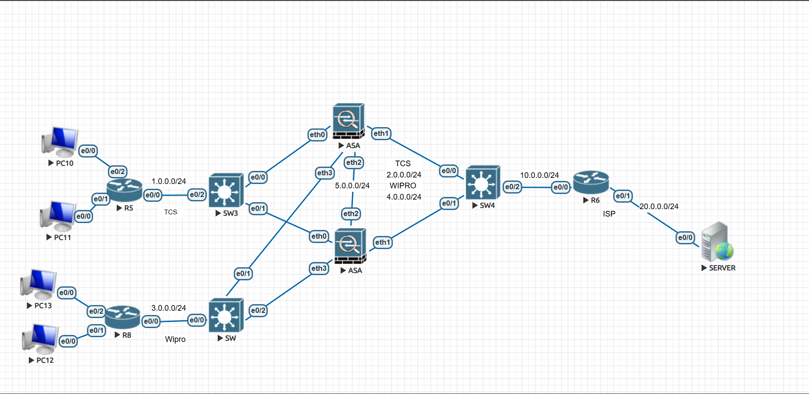
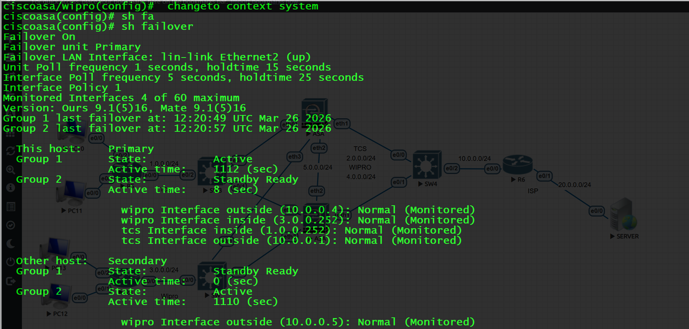
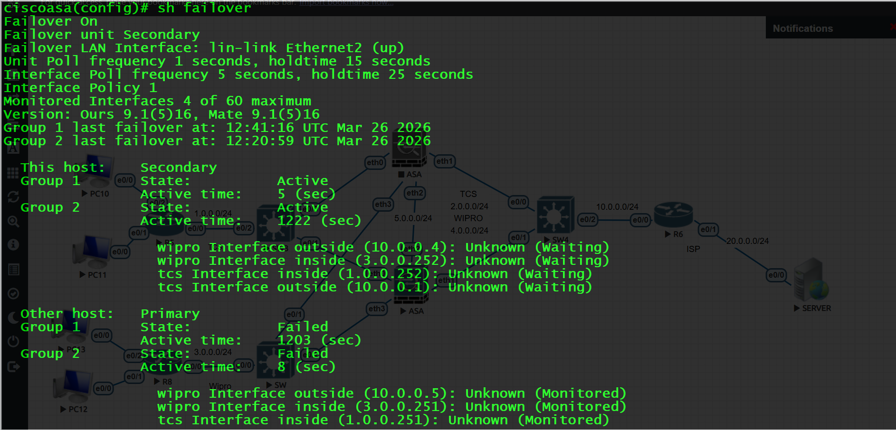
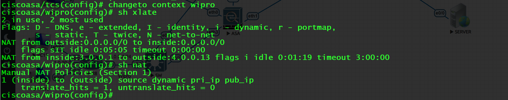

# Cisco ASA Multi-Context Active-Active Failover Architecture

**Enterprise Multi-Tenant Firewall Deployment with High Availability**

This project implements a production-grade network design using **Cisco ASA 5520** firewalls in **Active-Active Failover** mode combined with **Multi-Context** technology. It demonstrates how two independent organizations (TCS and Wipro) can share a common ISP uplink while maintaining complete traffic isolation, independent security policies, and sub-second redundancy.

Designed to showcase advanced expertise in firewall virtualization, high-availability clustering, and multi-tenant architectures — highly relevant for **Network Security Engineer**, **Firewall Administrator**, and **ISP Network** roles.

---

## Network Topology

```mermaid
flowchart TD
    Internet[Internet]
    ISP["ISP Router<br>10.0.0.254"]

    ASA1["ASA 1<br>Primary"]
    ASA2["ASA 2<br>Secondary"]

    TCS_Inside["TCS Inside<br>1.0.0.0/24"]
    Wipro_Inside["Wipro Inside<br>3.0.0.0/24"]

    TCS_Router["TCS Router + PCs"]
    Wipro_Router["Wipro Router + PCs"]

    Internet --> ISP
    ISP --> ASA1
    ISP --> ASA2

    ASA1 <-->|Failover Link| ASA2

    ASA1 --> TCS_Inside
    ASA2 --> TCS_Inside
    ASA1 --> Wipro_Inside
    ASA2 --> Wipro_Inside

    TCS_Inside --> TCS_Router
    Wipro_Inside --> Wipro_Router

    classDef asa fill:#e3f2fd,stroke:#1976d2,stroke-width:2px
    class ASA1 ASA2 asa
## Key Features

Active-Active Failover using Failover Groups for true load sharing
Multi-Context Mode enabling two fully independent virtual firewalls on shared physical hardware
Complete isolation between TCS (1.0.0.0/24) and Wipro (3.0.0.0/24) internal networks
Shared ISP connectivity with dedicated public IP pools and Dynamic NAT
Interface security-level enforcement and stateful failover
Built and tested on EVE-NG lab environment

Technologies:
Cisco ASA 9.1(5)16 | Multi-Context Mode | Active-Active Failover | Object-Based NAT | Security Levels | Extended ACLs

Context Configurations
1. TCS Context
File: configs/tcs_config.txt
cisco: Saved
: ASA Version 9.1(5)16 <context>
!
hostname tcs
enable password 8Ry2YjIyt7RRXU24 encrypted
names
!
interface Ethernet0
 nameif inside
 security-level 100
 ip address 1.0.0.252 255.255.255.0 standby 1.0.0.251
!
interface Ethernet1
 nameif outside
 security-level 0
 ip address 10.0.0.1 255.255.255.0 standby 10.0.0.2
!
object network pub_ip
 range 2.0.0.5 2.0.0.20
object network pri_ip
 subnet 1.0.0.0 255.255.255.0
!
access-list in-out extended permit tcp host 1.0.0.1 host 10.0.0.254 eq telnet
access-list in-out extended permit tcp host 1.0.0.1 host 20.0.0.1 eq telnet
access-list in-out extended permit icmp host 1.0.0.1 host 20.0.0.1 echo-reply
!
nat (inside,outside) source dynamic pri_ip pub_ip
access-group in-out in interface inside
route outside 0.0.0.0 0.0.0.0 10.0.0.254 1
!
service-policy global_policy global
2. Wipro Context
File: configs/wipro_config.txt
cisco: Saved
: ASA Version 9.1(5)16 <context>
!
hostname wipro
enable password 8Ry2YjIyt7RRXU24 encrypted
names
!
interface Ethernet1
 nameif outside
 security-level 0
 ip address 10.0.0.4 255.255.255.0 standby 10.0.0.5
!
interface Ethernet3
 nameif inside
 security-level 100
 ip address 3.0.0.252 255.255.255.0 standby 3.0.0.251
!
object network pri_ip
 subnet 3.0.0.0 255.255.255.0
object network pub_ip
 range 4.0.0.10 4.0.0.30
!
access-list in-out extended permit tcp host 3.0.0.1 host 10.0.0.254 eq telnet
access-list in-out extended permit tcp host 3.0.0.1 host 20.0.0.1 eq telnet
!
nat (inside,outside) source dynamic pri_ip pub_ip
access-group in-out in interface inside
route outside 0.0.0.0 0.0.0.0 10.0.0.254 1
!
service-policy global_policy global

Repository Structure
textcisco-asa-multi-context-active-active-failover/
├── README.md
├── configs/
│   ├── tcs_config.txt
│   └── wipro_config.txt
├── system-context/
│   └── system_config_example.txt
├── docs/
│   ├── failover-guide.md
│   └── testing-scenarios.md
└── screenshots/                  ← Lab screenshots

System Context Reference
Contexts are created in the System Execution Space using:

mode multiple
Context definition with interface allocation (allocate-interface)
Failover Groups configuration for Active-Active behavior

Refer to system-context/system_config_example.txt for detailed example.

Verification Commands
ciscoshow failover
show context
show interface ip brief
show nat detail
show xlate
show access-list
show route

Lab Screenshots
1. Full Network Topology

2. Normal Operation (Primary ASA)

3. Normal Operation (Secondary ASA)

4. Failover Test - ASA1 Down

5. Failover Test - ASA2 Down

6. NAT Translations - TCS Context

7. NAT Translations - Wipro Context


Design Objectives Achieved

True multi-tenancy with optimal resource utilization on shared hardware
Fully independent routing tables, NAT rules, and security policies per context
High availability with load sharing between two physical ASA units
Secure shared ISP connectivity while maintaining strict customer isolation

This architecture closely mirrors real-world deployments used by service providers and large enterprises for hosting multiple customers on shared infrastructure.